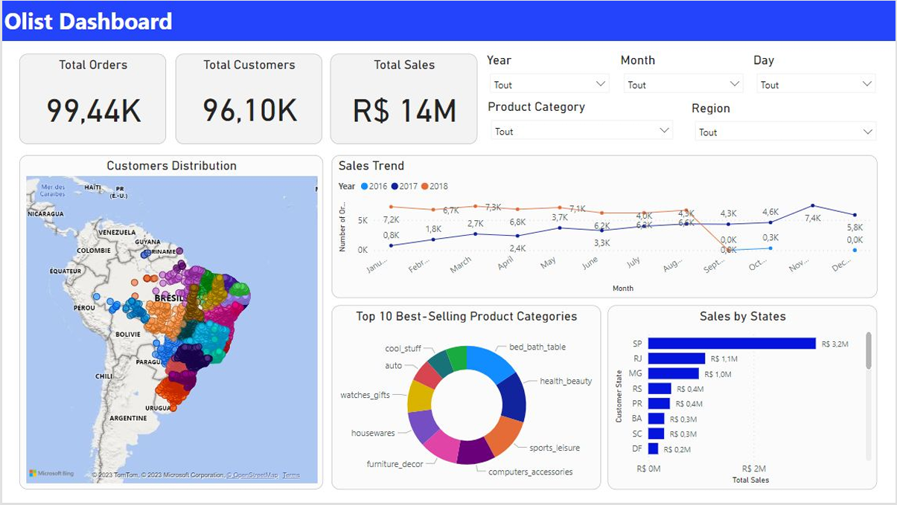
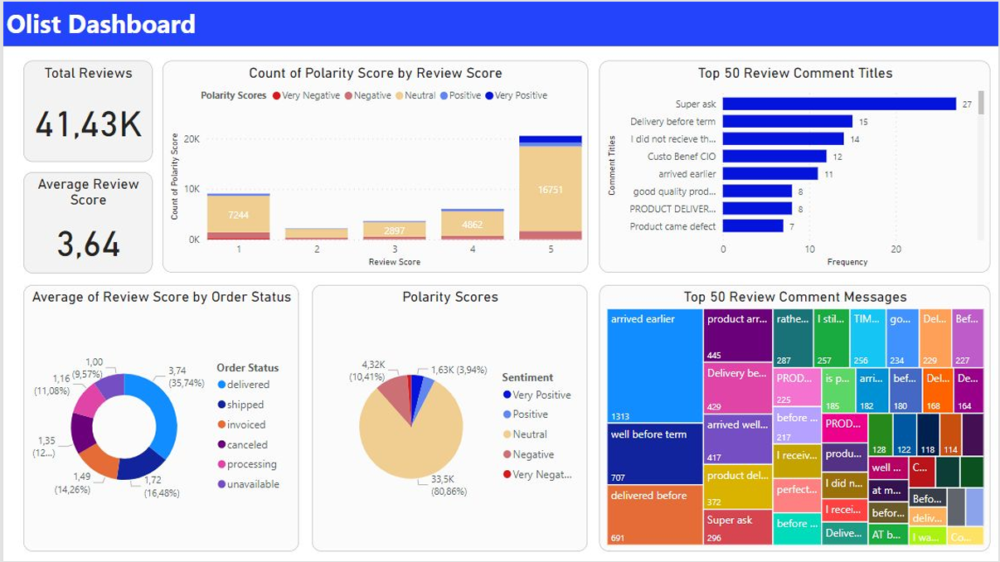
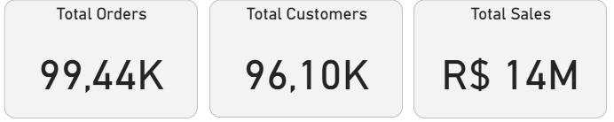
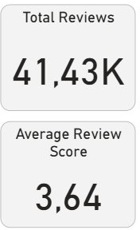

# Olist-e-commerce-plateform-analysis
Ce projet réalise une base de données relationnelle en utilisant SQL sur la plateforme Postgre. Elle est composée de neuf tables correspondant à différents jeux de données transactionnels publiques de la plus grande plateforme d’e-commerce du Brésil, à savoir Olist. Il s’agit de données d’environ 100 000 commandes effectuées de 2016 à 2018.

Partant de 0, on collecte, stocke et prépare de manière minutieuse l’ensemble des données dans l’objectif de construire ces tables SQL. L’ensemble de ces étapes vous sont soigneusement expliqués par la suite offrant une explication détaillée du fruit de notre travail.

Les données issus de la base Olist sont d’une importance capitale et stratégique. Son positionnement sur le marché (plus grande plateforme d’e commerce au  Brésil) font que ces données représentent une valeur capital de l'écosystème  du commerce en ligne dans ces pays en plein essor. De plus, cette base de données est un modèle important, du fait que ces donnés soient répartis sur un panel large (de 2016 à 2018) avec un nombre très élevé de commandes( environ 100 000). Ces éléments nous permettent d’analyser et d’évaluer des données pour en déceler des informations sur les tendances à long terme, sur les tendances de marchés, les préférences et besoins clients dans une logique d’amélioration de la performance et l'efficacité d’une entreprise. La base de données d'Olist, avec ses neuf tables distinctes couvrant une multitude d'informations cruciales, est ainsi un élément stratégique et un atout majeur pour être une marketplace e commerce qui peut améliorer l'expérience client, augmenter la rentabilité et maintenir la compétitivité dans un environnement de commerce électronique en constante évolution. 

[Olist dataset sur kaggle](https://www.kaggle.com/datasets/olistbr/brazilian-ecommerce)

## Description des données :
**Table :**
Il s’agit de la structure de la base de données. En effet, elle représente l’ensemble des données organisées. On parle alors d’un élément permettant de stocker des informations structurées de manière tabulaire.

**Classe :**
Il s’agit de la conceptualisation d’un objet réel. Elle permet de définir la structure et les caractéristiques d’un objet.

**Attribut :**
Il s’agit d’un champ dans une table qui permet de définir le type de donnée qu’elle peut contenir. Ainsi, les attributs définissent la structure de la table.

**Clé primaire :**
Il s’agit d’un attribut ou d’un ensemble d’attributs présent dans la table de base de données permettant d’identifier de manière unique chaque attributs de la table.

**Clé étrangère :**
Il s’agit d’un attribut dans la table de base de données qui établit une relation entre deux tables et ce grâce au référencement de la clé primaire d’une autre table.On parle alors de relations entre les données.

## La base de données d'Olist est structurée en neuf tables distinctes, chacune ayant un rôle spécifique dans l'organisation et la gestion des données :
**olist_customers :** 
Cette table contient des informations sur les clients, avec une clé primaire pour identifier de manière unique chaque client.

**olist_geolocation :** 
Cette table concerne la géolocalisation, mais elle ne dispose pas de clé primaire.

**product_category_name_translation :** 
Cette table est liée à la traduction des noms de catégories de produits. Elle ne possède pas de clé primaire.

**olist_orders :**
Cette table recueille des données sur les commandes et possède une clé primaire pour identifier chaque commande de manière unique.

**olist_products :** 
Elle contient des informations sur les produits, avec une clé primaire pour chaque produit.

**olist_sellers :** 
Cette table comprend des données sur les vendeurs, avec une clé primaire pour les identifier de manière unique.

**olist_order_reviews :** 
Elle stocke les avis sur les commandes et dispose d'une clé secondaire liée aux commandes.

**olist_order_payments :** 
Cette table enregistre des informations sur les paiements, avec une clé secondaire liée aux commandes.

**olist_order_items :** 
Cette table concerne les articles des commandes, avec une clé secondaire liée aux commandes.

## Analyse des données : 
Pour obtenir des meilleurs insights on répond aux questions suivantes, qui vont permettre par la suite 
d’avoir une visibilité pertinente et obtenir des meilleures perspectives sur la plateforme de e-commerce 
afin d’améliorer l’activité.
1. Les revenues de la plateforme avec le nombre d’ordres et de clients.
2. Les revenues par année et par mois avec les types de paiement.
3. Les revenues par provinces et la distribution des clients 
4. Revenues par catégories de produits.
5. Nombre de reviews et la moyenne de score review.
6. Statut de livraison et le nombre de statut de satisfaction par score review.
7. Top 50 messages et comments review.

### 1. Les revenues de la plateforme avec le nombre d’ordres et de clients : 

La plateforme Olist a pu générer 14M R$ de revenues dans les trois années 2016, 2017 et 2018 avec un nombre de 96,10K clients sur un totale de 99,44K d’ordres.

### 2. Les revenues par année et par mois avec les types de paiement :

 

Les ventes par année et par Mois permet de visualiser les trends de ventes et distinguer les périodes où la plateforme fait le plus et moins de ventes, ce qui permet à s’améliorer sur les périodes de faible rentabilité.
Le paiement type représente les choix des payements les plus utilisés par les clients; le credit card, Boleto et  Voucher,  ce qui permet à la plateforme d’adapter ces options de paiements selon les préférences des clients.

### 3. Les revenues par provinces et la distribution des clients :

 

Le graphique représente les ventes de la plateforme effectués par province, et la 
distribution des clients sur la carte, cela permet aux décideurs de constater les 
régions moins rentables ou quasiment nulles afin d’améliorer l’activité sur ces 
régions.  
Le plus grand nombre de ventes a été réalisé à São Paulo, avec un total de 3,2M de 
réais. Ensuite, on note l'État de Rio de Janeiro avec 1,1M de réais.

### 4. Revenues par catégories de produits : 

La représentation des 10 produits top vendu permet de savoir les quels sont les produits qui ont pu gêner le plus de chiffre d’affaire et aussi de constaté certains caractéristiques ou paramètres qui permettra de pousser d’autres produits à générer plus de chiffre d’affaires.
les produits les plus vendus sur l'ensemble des années correspondent au "bed bath table", suivi de la "health beauty" et des "sports leisure".

### 5. Nombre de reviews et la moyenne de score review :

 

La moyenne est 3,64 sur 5 de review des clients sur la plateforme sur les trois ans 2016, 2017 et 2018, sur un totale de 41,43K reviews. Ce qui permet de constater l’avis des clients d’une façon générale vis-à-vis de la plateforme.

### 6. Statut de livraison et le nombre de statut de satisfaction par score review :

Les graphiques représentent les statuts de commandes avec le score review et le sentiment des clients par rapport à leurs commandes, cela permet donc de savoir l’avis des clients sur leurs commandes et leurs sentiments vis-à-vis de la livraison afin de l’améliorer. 
On le statut delivered est le plus important avec un pourcentage de 36% et un scor review de 3,74. Les sentiments par rapport à ces statues sont majoritairement neutre avec un pourcentage de 80% et un nombre totale de review 33,5K. 

### 7. Top 50 messages et comments review :

La représentation des top 50 messages et commentaires des clients,  permet d’avoir l’avis du client sur la plateforme de façon plus personnalisée et plus précise.
On trouve par exemple en premier pour les commentaires “Arrived earlier” 1313 fois, “Well before term” 707 fois et “Delivered before” 691 fois

